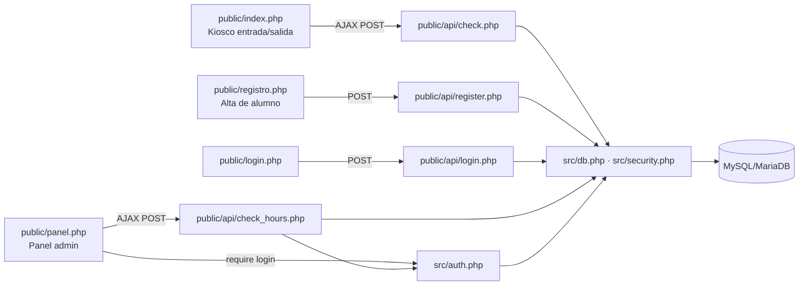
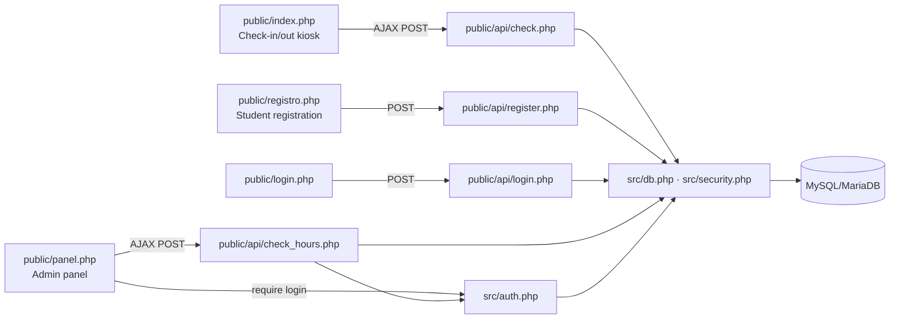

# Control de Horas de Servicio Social / Prácticas · Service Social & Internship Hours Tracker

<p align="left">
  
  
  
  
  
</p>

Aplicación web construida en PHP para controlar la entrada y salida de estudiantes que realizan su servicio social o prácticas profesionales, y para que un administrador consulte las horas acumuladas por alumno y genere un reporte descargable.

Web application built in PHP to track check-in/check-out times for students completing mandatory social service or professional internships, and to let an administrator query each student's accumulated hours and generate a downloadable report.

**🇪🇸 [Español](#español-1)** · **🇬🇧 [English](#english-1)**

> **Nota de portafolio / Portfolio note:** este repositorio es una versión pública y generalizada de un sistema desarrollado originalmente durante un servicio social universitario. Se eliminaron credenciales reales, nombres de personas y cualquier logotipo institucional; las contraseñas se manejan con hash y la base de datos de ejemplo solo contiene una cuenta demo. // This repository is a public, generalized version of a system originally built during a university social-service program. Real credentials, personal names, and institutional logos were removed; passwords are hashed, and the sample database only contains a demo account.

---

## Tabla de contenido / Table of contents

- [Español](#español-1)
  - [Descripción](#descripción)
  - [El problema](#el-problema)
  - [Arquitectura](#arquitectura)
  - [Funcionalidades](#funcionalidades)
  - [Tecnologías](#tecnologías)
  - [Requisitos](#requisitos)
  - [Instalación paso a paso](#instalación-paso-a-paso)
  - [Configuración](#configuración)
  - [Uso del sistema](#uso-del-sistema)
  - [Seguridad implementada](#seguridad-implementada)
  - [Estructura del proyecto](#estructura-del-proyecto)
  - [Problemas comunes](#problemas-comunes)
  - [Roadmap / Posibles mejoras futuras](#roadmap--posibles-mejoras-futuras)
- [English](#english-1)
  - [Description](#description)
  - [The problem](#the-problem)
  - [Architecture](#architecture)
  - [Features](#features)
  - [Tech stack](#tech-stack)
  - [Requirements](#requirements)
  - [Step-by-step installation](#step-by-step-installation)
  - [Configuration](#configuration-1)
  - [Application usage](#application-usage)
  - [Implemented security](#implemented-security)
  - [Project structure](#project-structure)
  - [Troubleshooting](#troubleshooting)
  - [Roadmap](#roadmap)
- [Licencia / License](#licencia--license)

---

## Español

### Descripción

Sistema web para registrar, mediante la matrícula del estudiante, las entradas y salidas de quienes realizan servicio social o prácticas profesionales, y para que el área administrativa consulte cuántas horas ha acumulado cada alumno en un rango de fechas, con un total histórico y generación de un reporte en PDF.

El proyecto está desarrollado en PHP plano (sin framework), MySQL/MariaDB, HTML/JavaScript y Bootstrap. Un kiosco de uso diario permite que el propio alumno registre su entrada o salida escribiendo solo su matrícula; un panel de administración protegido por login permite buscar horas por alumno y por rango de fechas.

### El problema

En muchas instituciones el control de horas de servicio social y prácticas profesionales se lleva de forma manual (listas de asistencia en papel o en hojas de cálculo compartidas), lo que dificulta saber en tiempo real cuántas horas lleva un alumno y si ya cumplió el mínimo requerido. Este sistema nació para resolver ese problema con un kiosco de autoservicio y un panel de consulta centralizado, evitando el conteo manual y reduciendo el margen de error humano.

### Arquitectura



| Módulo | Responsabilidad |
|---|---|
| `src/db.php` | Conexión mysqli compartida; sustituye las conexiones duplicadas que antes vivían en cada script. |
| `src/security.php` | Headers defensivos, sesión endurecida, tokens CSRF y rate limiting del login. |
| `src/auth.php` | Verificación de credenciales de administrador (con hash), guarda de sesión y login/logout. |
| `public/index.php` | Kiosco de uso diario: el alumno escribe su matrícula para registrar entrada o salida. |
| `public/registro.php` | Alta única del alumno (nombre, matrícula, teléfono). |
| `public/login.php` / `public/panel.php` | Login del administrador y panel de consulta de horas + generación de PDF. |
| `public/api/*.php` | Endpoints que reciben las peticiones AJAX/POST de las vistas anteriores. |

### Funcionalidades

#### Kiosco De Entrada Y Salida

- Registro de entrada/salida con solo escribir la matrícula, sin necesidad de contraseña (pensado para un dispositivo físico de autoservicio).
- Detección automática de si corresponde registrar una entrada o una salida según el último movimiento del alumno.
- Manejo de sesiones abandonadas: si pasaron 12 horas o más desde la última entrada sin haber registrado salida, el sistema abre una entrada nueva en lugar de forzar una salida con datos poco confiables.

#### Registro De Alumnos

- Alta única por matrícula (nombre completo, matrícula, teléfono).
- Validación de formato de matrícula (3 letras + 6 dígitos) desde el propio formulario.
- Prevención de registros duplicados por matrícula, tanto a nivel de aplicación como a nivel de base de datos.

#### Panel Administrativo

- Login protegido por usuario y contraseña con hash.
- Búsqueda de horas acumuladas por matrícula y rango de fechas, con selector de rango de fechas en español.
- Cálculo de horas del rango seleccionado y del total histórico acumulado.
- Generación de un reporte en PDF con el resultado de la búsqueda.

#### Seguridad

- Ver la sección [Seguridad implementada](#seguridad-implementada) más abajo.

### Tecnologías

| Tecnología | Rol en el proyecto | Por qué se eligió |
|---|---|---|
| **PHP 8** | Lenguaje del backend, sin framework. | El proyecto es de tamaño pequeño/mediano y no requiere el enrutamiento ni el ORM de un framework completo; PHP plano con mysqli es suficiente y fácil de auditar archivo por archivo. |
| **MySQL / MariaDB** | Motor de base de datos relacional. | Es el motor estándar disponible en prácticamente cualquier hosting compartido, y el modelo de datos (alumnos, entradas, salidas) encaja de forma natural en tablas relacionales con llaves foráneas. |
| **mysqli (prepared statements)** | Acceso a datos desde PHP. | Prepared statements con `bind_param` evitan inyección SQL sin necesitar un ORM completo. |
| **Bootstrap 5** | Framework CSS para layout y componentes. | Permite una interfaz utilizable rápidamente (formularios, tarjetas, botones) sin escribir CSS extenso desde cero. |
| **jQuery** | Manipulación del DOM y peticiones AJAX. | El proyecto es pequeño en JavaScript; jQuery simplifica las llamadas AJAX a los endpoints PHP sin necesidad de un framework de frontend. |
| **bootstrap-datepicker** | Selector de rango de fechas en el panel admin. | Componente ligero, con soporte de idioma español, para elegir el rango de fechas a consultar. |
| **jsPDF** | Generación de PDF en el navegador. | Permite exportar el resultado de una consulta a PDF sin necesidad de una librería de generación de PDF en el servidor. |
| **Apache + .htaccess** | Servidor web y headers de seguridad. | Es el servidor más común en hosting compartido tipo LAMP; `.htaccess` permite aplicar headers defensivos sin tocar la configuración global del servidor. |

### Requisitos

- **PHP 8.0 o superior** con la extensión `mysqli` habilitada.
- **MySQL 8.x o MariaDB 10.x**.
- **Servidor Apache** (por ejemplo, XAMPP en Windows) con `mod_headers` habilitado, o el servidor embebido de PHP para pruebas rápidas.
- **Navegador web moderno** (Chrome, Edge o Firefox recientes).

### Instalación Paso A Paso

**1. Clona el repositorio**

```powershell
git clone https://github.com/Marco2004/-rastreador-de-horas-de-servicio-service-hours-tracker.git
cd ./-rastreador-de-horas-de-servicio-service-hours-tracker
```

**2. Crea la base de datos e importa el esquema**

Con XAMPP/phpMyAdmin, o desde la terminal:

```powershell
mysql -u root -e "CREATE DATABASE serviciosocial CHARACTER SET utf8mb4"
mysql -u root --default-character-set=utf8mb4 serviciosocial < database/schema.sql
```

`database/schema.sql` crea las tablas necesarias e inserta una cuenta de administrador de ejemplo (usuario `admin`, contraseña `Admin123!`, ya guardada con hash). **Cambia esta contraseña de inmediato en cualquier instalación real.**

> **Importante:** el archivo incluye una `ñ` (columna `contraseña`) y está guardado en UTF-8. Si importas sin `--default-character-set=utf8mb4`, el cliente de `mysql` puede usar su charset por defecto del sistema para leer el archivo y corromper ese nombre de columna (mojibake), lo que rompe el login. Si ya importaste sin esa bandera, vuelve a crear la base de datos desde cero con el comando de arriba.

**3. Crea tu archivo de configuración local**

```powershell
copy config.example.php config.php
```

Edita `config.php` con los datos reales de tu base de datos (`DB_HOST`, `DB_NAME`, `DB_USER`, `DB_PASS`). Este archivo está excluido por `.gitignore` y nunca debe subirse a un repositorio.

**4. Levanta el servidor**

Para pruebas rápidas, con el servidor embebido de PHP (sirviendo únicamente la carpeta `public/`, que es el docroot real de la aplicación):

```powershell
php -S localhost:8000 -t public
```

Para un entorno más parecido a producción, coloca el proyecto dentro de `htdocs` de XAMPP y, si tu configuración de Apache lo permite, apunta el `DocumentRoot` del sitio a la carpeta `public/`. Si no puedes cambiar el `DocumentRoot`, el sistema sigue funcionando accediendo directamente a `http://localhost/-rastreador-de-horas-de-servicio-service-hours-tracker/public/`.

**5. Abre el navegador**

```text
http://localhost:8000/index.php
```

Deberías ver el kiosco de entrada/salida. Para llegar al panel de administración, entra a `http://localhost:8000/login.php` con el usuario demo.

### Configuración

Toda la configuración sensible vive en `config.php` (no versionado). La plantilla pública `config.example.php` documenta cada valor:

| Constante | Uso | Ejemplo |
|---|---|---|
| `DB_HOST` | Host del servidor de base de datos. | `127.0.0.1` |
| `DB_NAME` | Nombre de la base de datos. | `serviciosocial` |
| `DB_USER` / `DB_PASS` | Credenciales de conexión. | `root` / `` |
| `DB_CHARSET` | Charset de la conexión. | `utf8mb4` |
| `APP_ENV` | Entorno de ejecución (`local` o `production`). | `local` |
| `APP_FORCE_HTTPS` | Fuerza la cookie de sesión como `secure`. Debe ser `true` si el sitio se sirve por HTTPS. | `false` |
| `LOGIN_MAX_ATTEMPTS` | Intentos fallidos de login permitidos antes de bloquear temporalmente una IP. | `5` |
| `LOGIN_LOCKOUT_SECONDS` | Duración del bloqueo, en segundos. | `300` |

### Uso Del Sistema

#### Registrar Un Alumno

1. Desde el kiosco (`index.php`), presiona **Registro**.
2. Llena nombre completo, matrícula (formato `ABC123456`) y teléfono.
3. Al guardar, si la matrícula ya existe se muestra una alerta y no se duplica el registro.

#### Registrar Entrada/Salida (Kiosco)

1. En la pantalla principal, el alumno escribe su matrícula y presiona buscar (o Enter).
2. El sistema determina automáticamente si corresponde registrar una entrada o una salida y muestra el resultado en pantalla.
3. El formulario se limpia solo después de unos segundos, dejando el kiosco listo para el siguiente alumno.

#### Panel De Administración

1. Entra a `login.php` con las credenciales de administrador.
2. En `panel.php`, escribe la matrícula del alumno y selecciona un rango de fechas.
3. Presiona **Buscar** para ver las horas del rango seleccionado y el total histórico acumulado.
4. Presiona **Generar PDF** para descargar el resultado.
5. Presiona **Cerrar sesión** para salir del panel.

### Seguridad Implementada

Este proyecto original no incluía prácticamente ninguna medida de seguridad (credenciales de base de datos en texto plano dentro del código, contraseñas de administrador sin hash, consultas SQL armadas por concatenación, sin CSRF, y un endpoint del panel que no verificaba sesión). La versión de este repositorio corrige todo lo anterior sin modificar el comportamiento observable del sistema:

- **Sin credenciales en el código**: toda la configuración sensible vive en `config.php`, excluido por `.gitignore`; el repositorio solo incluye `config.example.php` como plantilla.
- **Consultas parametrizadas**: todas las consultas SQL usan `mysqli` con `prepare()`/`bind_param()` en vez de concatenar variables directamente en el SQL.
- **Contraseñas con hash**: las contraseñas de administrador se guardan con `password_hash()` y se verifican con `password_verify()`, nunca en texto plano.
- **Protección CSRF**: los formularios de login, registro y las búsquedas del panel administrativo incluyen un token de sincronización validado en el servidor.
- **Control de acceso reforzado**: el endpoint que expone las horas acumuladas de un alumno (`api/check_hours.php`) ahora exige una sesión de administrador activa; antes podía consultarse sin haber iniciado sesión.
- **Sesión endurecida**: cookies `HttpOnly`, `SameSite`, `secure` condicional a HTTPS, y regeneración del ID de sesión al iniciar sesión (protección contra *session fixation*).
- **Rate limiting del login**: una IP que falla el login repetidamente queda bloqueada temporalmente (configurable), mitigando ataques de fuerza bruta.
- **Headers HTTP defensivos**: `X-Content-Type-Options`, `X-Frame-Options`, `Referrer-Policy`, `Permissions-Policy` y una `Content-Security-Policy` restrictiva, aplicados tanto vía `.htaccess` como desde PHP.
- **Integridad de subrecursos (SRI)**: los scripts y estilos cargados desde CDN (Bootstrap, Font Awesome, jQuery, etc.) incluyen verificación `integrity`/`crossorigin`, para detectar si el archivo servido por el CDN fuera alterado.
- **Manejo de errores sin fuga de información**: los errores de conexión a la base de datos se registran en el log del servidor, no se muestran al cliente.

Notas importantes:

- El sistema no incluye gestión de roles ni múltiples niveles de permisos: solo existe una cuenta de tipo administrador.
- Si se expone fuera de una red interna controlada, se recomienda servir el sitio por HTTPS y activar `APP_FORCE_HTTPS`.
- El límite de intentos de login es por IP; en redes con NAT compartido (por ejemplo, todo un plantel saliendo por la misma IP pública) puede requerir ajustar `LOGIN_MAX_ATTEMPTS`.

### Estructura Del Proyecto

```text
-rastreador-de-horas-de-servicio-service-hours-tracker/
├── config.example.php
├── config.php                  (no versionado)
├── database/
│   └── schema.sql
├── src/
│   ├── db.php
│   ├── security.php
│   └── auth.php
└── public/
    ├── .htaccess
    ├── index.php               (kiosco)
    ├── registro.php
    ├── login.php
    ├── panel.php
    ├── api/
    │   ├── check.php
    │   ├── check_hours.php
    │   ├── login.php
    │   ├── logout.php
    │   └── register.php
    └── assets/
        ├── css/
        ├── js/
        └── img/
```

### Problemas Comunes

#### La página se ve sin estilos / errores de integridad en la consola

Los recursos de CDN (Bootstrap, Font Awesome, etc.) incluyen verificación `integrity` (SRI). Si el navegador bloquea alguno, revisa la consola: puede deberse a un bloqueo de red hacia el CDN, no a un problema del proyecto.

#### `Error de conexión con la base de datos.`

Confirma que `config.php` exista (copiado desde `config.example.php`) y que `DB_HOST`/`DB_USER`/`DB_PASS`/`DB_NAME` correspondan a tu instalación local de MySQL/MariaDB.

#### El login no funciona con una cuenta migrada de una instalación anterior

Si vienes de una versión previa del sistema con contraseñas en texto plano, esas contraseñas deben migrarse a `password_hash()` antes de usar este código; de lo contrario `password_verify()` nunca coincidirá.

#### Demasiados intentos fallidos / login bloqueado

Es el rate limiting de `LOGIN_MAX_ATTEMPTS`/`LOGIN_LOCKOUT_SECONDS`. Espera la ventana configurada o ajusta esos valores en `config.php` para desarrollo local.

### Roadmap / Posibles Mejoras Futuras

Estas mejoras se identificaron durante el desarrollo original pero no llegaron a implementarse; se documentan aquí como evolución natural del proyecto:

1. **Campo de tipo de colaboración** (Servicio Social / Prácticas Profesionales) en el registro del alumno. Actualmente el sistema no distingue entre ambos programas, aunque ambos comparten la misma regla institucional de un mínimo de 480 horas en un periodo de 6 a 12 meses. Agregar esta clasificación permitiría filtrar y reportar por tipo de programa sin alterar la lógica de cómputo de horas.
2. **PDF autorellenable con plantilla oficial**. Hoy el reporte se genera volcando texto plano a un PDF genérico con jsPDF. La idea original era que el sistema tomara un formato PDF predeterminado y oficial de la institución (membrete, campos fijos) y lo autorellenara con los datos del alumno, de forma análoga a un reporte basado en plantilla.
3. **Numeración de reporte autoincremental**. Cada reporte generado debería llevar un folio secuencial único (respaldado por una tabla dedicada y un trigger a nivel de base de datos), útil para trazabilidad administrativa.
4. **Límite de 6 a 12 reportes por alumno**. Ligado al ciclo de 6 a 12 meses de duración del servicio/prácticas, limitando cuántos reportes mensuales puede generar un mismo alumno a lo largo de su periodo.
5. **Horas restantes al registrar salida**. Mostrar en el momento del check-out cuántas horas le faltan al alumno para llegar a las 480 horas requeridas.
6. **Notificación de servicio completado**. Aviso automático cuando un alumno alcanza o supera las 480 horas acumuladas.
7. **Gestión de estatus del alumno** (activo / completado / inactivo sin completar), con opción de depurar del sistema a quienes ya completaron su servicio en lugar de dejar todos los registros mezclados indefinidamente.
8. **Notificación de inactividad prolongada**. Alertar sobre alumnos que llevan mucho tiempo sin registrar entrada/salida, para dar seguimiento a quienes pudieron haber abandonado el programa sin avisar.
9. **Suite de pruebas automatizadas e integración continua**, ausente en la versión actual del proyecto.

---

## English

### Description

Web system to register, using only a student ID number, the check-in and check-out times of students completing mandatory social service or professional internships, and to let administrative staff query how many hours a student has accumulated within a date range, along with a lifetime total and a downloadable PDF report.

The project is built in plain PHP (no framework), MySQL/MariaDB, HTML/JavaScript, and Bootstrap. A daily-use kiosk lets students check in/out by typing only their student ID; a login-protected admin panel lets staff search hours by student and date range.

### The Problem

At many institutions, tracking social-service and internship hours is still done manually (paper sign-in sheets or shared spreadsheets), making it hard to know in real time how many hours a student has completed or whether they've met the required minimum. This system was built to solve that with a self-service kiosk and a centralized query panel, removing manual counting and reducing human error.

### Architecture



| Module | Responsibility |
|---|---|
| `src/db.php` | Shared mysqli connection; replaces the duplicated connection code that previously lived in every script. |
| `src/security.php` | Defensive headers, hardened sessions, CSRF tokens, and login rate limiting. |
| `src/auth.php` | Admin credential verification (hashed), session guard, and login/logout. |
| `public/index.php` | Daily-use kiosk: students type their ID to check in or out. |
| `public/registro.php` | One-time student registration (name, ID, phone). |
| `public/login.php` / `public/panel.php` | Admin login and the hours-lookup panel with PDF export. |
| `public/api/*.php` | Endpoints that receive the AJAX/POST requests from the views above. |

### Features

#### Check-In/Out Kiosk

- Check-in/out by typing only the student ID, no password required (designed for a physical self-service device).
- Automatically detects whether a check-in or check-out should be recorded based on the student's last movement.
- Handles abandoned sessions: if 12+ hours have passed since the last check-in with no matching check-out, the system opens a new check-in instead of forcing an unreliable check-out.

#### Student Registration

- One-time registration by student ID (full name, ID, phone number).
- Student ID format validation (3 letters + 6 digits) directly in the form.
- Duplicate-ID prevention at both the application and database level.

#### Admin Panel

- Login protected by username and hashed password.
- Search accumulated hours by student ID and date range, with a Spanish-language date range picker.
- Computes hours for the selected range plus the lifetime accumulated total.
- Generates a downloadable PDF report from the search result.

#### Security

- See [Implemented Security](#implemented-security) below.

### Tech Stack

| Technology | Role in the project | Why it was chosen |
|---|---|---|
| **PHP 8** | Backend language, no framework. | The project is small/medium-sized and doesn't need a full framework's routing or ORM; plain PHP with mysqli is enough and easy to audit file by file. |
| **MySQL / MariaDB** | Relational database engine. | The standard engine available on virtually any shared hosting, and the data model (students, check-ins, check-outs) fits naturally into relational tables with foreign keys. |
| **mysqli (prepared statements)** | Data access from PHP. | Prepared statements with `bind_param` prevent SQL injection without needing a full ORM. |
| **Bootstrap 5** | CSS framework for layout and components. | Enables a usable interface quickly (forms, cards, buttons) without writing extensive custom CSS. |
| **jQuery** | DOM manipulation and AJAX requests. | The project's JavaScript footprint is small; jQuery simplifies AJAX calls to the PHP endpoints without a frontend framework. |
| **bootstrap-datepicker** | Date range picker in the admin panel. | Lightweight component with Spanish-language support for selecting the query date range. |
| **jsPDF** | Client-side PDF generation. | Lets the search result be exported to PDF without a server-side PDF library. |
| **Apache + .htaccess** | Web server and security headers. | The most common server on LAMP-style shared hosting; `.htaccess` allows defensive headers without touching global server config. |

### Requirements

- **PHP 8.0 or newer** with the `mysqli` extension enabled.
- **MySQL 8.x or MariaDB 10.x**.
- **Apache server** (e.g., XAMPP on Windows) with `mod_headers` enabled, or PHP's built-in server for quick local testing.
- **Modern web browser** (recent Chrome, Edge, or Firefox).

### Step-By-Step Installation

**1. Clone the repository**

```powershell
git clone https://github.com/Marco2004/-rastreador-de-horas-de-servicio-service-hours-tracker.git
cd ./-rastreador-de-horas-de-servicio-service-hours-tracker
```

**2. Create the database and import the schema**

Using XAMPP/phpMyAdmin, or from the terminal:

```powershell
mysql -u root -e "CREATE DATABASE serviciosocial CHARACTER SET utf8mb4"
mysql -u root --default-character-set=utf8mb4 serviciosocial < database/schema.sql
```

`database/schema.sql` creates the required tables and seeds a demo admin account (username `admin`, password `Admin123!`, already stored as a hash). **Change this password immediately on any real installation.**

> **Important:** the file contains a Spanish `ñ` (column `contraseña`) and is saved as UTF-8. Importing without `--default-character-set=utf8mb4` may cause the `mysql` client to read the file using the system's default charset instead, corrupting that column name (mojibake) and breaking login. If you already imported without that flag, recreate the database from scratch with the command above.

**3. Create your local configuration file**

```powershell
copy config.example.php config.php
```

Edit `config.php` with your real database details (`DB_HOST`, `DB_NAME`, `DB_USER`, `DB_PASS`). This file is excluded via `.gitignore` and must never be committed.

**4. Start the server**

For quick local testing, using PHP's built-in server (serving only the `public/` folder, which is the application's real docroot):

```powershell
php -S localhost:8000 -t public
```

For something closer to production, place the project inside XAMPP's `htdocs` folder and, if your Apache configuration allows it, point the site's `DocumentRoot` to the `public/` folder. If you can't change the `DocumentRoot`, the system still works by browsing directly to `http://localhost/-rastreador-de-horas-de-servicio-service-hours-tracker/public/`.

**5. Open the browser**

```text
http://localhost:8000/index.php
```

You should see the check-in/out kiosk. To reach the admin panel, go to `http://localhost:8000/login.php` with the demo account.

### Configuration

All sensitive configuration lives in `config.php` (not version-controlled). The public template `config.example.php` documents every value:

| Constant | Purpose | Example |
|---|---|---|
| `DB_HOST` | Database server host. | `127.0.0.1` |
| `DB_NAME` | Database name. | `serviciosocial` |
| `DB_USER` / `DB_PASS` | Connection credentials. | `root` / `` |
| `DB_CHARSET` | Connection charset. | `utf8mb4` |
| `APP_ENV` | Runtime environment (`local` or `production`). | `local` |
| `APP_FORCE_HTTPS` | Forces the session cookie to `secure`. Must be `true` if served over HTTPS. | `false` |
| `LOGIN_MAX_ATTEMPTS` | Failed login attempts allowed before temporarily blocking an IP. | `5` |
| `LOGIN_LOCKOUT_SECONDS` | Lockout duration, in seconds. | `300` |

### Application Usage

#### Register A Student

1. From the kiosk (`index.php`), click **Registro**.
2. Fill in full name, student ID (format `ABC123456`), and phone number.
3. On save, if the ID already exists, an alert is shown and no duplicate is created.

#### Check-In/Out (Kiosk)

1. On the main screen, the student types their ID and presses search (or Enter).
2. The system automatically determines whether a check-in or check-out applies and shows the result on screen.
3. The form clears itself after a few seconds, leaving the kiosk ready for the next student.

#### Admin Panel

1. Go to `login.php` with the admin credentials.
2. In `panel.php`, type the student's ID and select a date range.
3. Click **Buscar** to see hours for the selected range plus the lifetime accumulated total.
4. Click **Generar PDF** to download the result.
5. Click **Cerrar sesión** to log out of the panel.

### Implemented Security

The original version of this project included essentially no security measures (database credentials hardcoded in plain text, admin passwords stored unhashed, SQL queries built by string concatenation, no CSRF protection, and a panel endpoint that didn't check for a session at all). This repository's version fixes all of the above without changing the system's observable behavior:

- **No credentials in source code**: all sensitive configuration lives in `config.php`, excluded via `.gitignore`; the repository only ships `config.example.php` as a template.
- **Parameterized queries**: every SQL query uses `mysqli` with `prepare()`/`bind_param()` instead of concatenating variables directly into SQL strings.
- **Hashed passwords**: admin passwords are stored with `password_hash()` and verified with `password_verify()`, never in plain text.
- **CSRF protection**: the login and registration forms, and the admin panel's search requests, include a synchronizer token validated server-side.
- **Hardened access control**: the endpoint that exposes a student's accumulated hours (`api/check_hours.php`) now requires an active admin session; previously it could be queried without logging in at all.
- **Hardened sessions**: `HttpOnly` cookies, `SameSite`, `secure` conditional on HTTPS, and session ID regeneration on login (protection against session fixation).
- **Login rate limiting**: an IP that repeatedly fails login is temporarily blocked (configurable), mitigating brute-force attacks.
- **Defensive HTTP headers**: `X-Content-Type-Options`, `X-Frame-Options`, `Referrer-Policy`, `Permissions-Policy`, and a restrictive `Content-Security-Policy`, applied both via `.htaccess` and from PHP.
- **Subresource Integrity (SRI)**: scripts and stylesheets loaded from CDNs (Bootstrap, Font Awesome, jQuery, etc.) include `integrity`/`crossorigin` verification, to detect if a CDN-served file were tampered with.
- **Error handling without information leakage**: database connection errors are logged server-side, never shown to the client.

Important notes:

- The system does not implement roles or multiple permission levels: there is only a single administrator account type.
- If exposed outside a controlled internal network, serve the site over HTTPS and enable `APP_FORCE_HTTPS`.
- The login attempt limit is per IP; on networks with shared NAT (e.g., an entire campus behind one public IP), you may need to adjust `LOGIN_MAX_ATTEMPTS`.

### Project Structure

```text
-rastreador-de-horas-de-servicio-service-hours-tracker/
├── config.example.php
├── config.php                  (not version-controlled)
├── database/
│   └── schema.sql
├── src/
│   ├── db.php
│   ├── security.php
│   └── auth.php
└── public/
    ├── .htaccess
    ├── index.php               (kiosk)
    ├── registro.php
    ├── login.php
    ├── panel.php
    ├── api/
    │   ├── check.php
    │   ├── check_hours.php
    │   ├── login.php
    │   ├── logout.php
    │   └── register.php
    └── assets/
        ├── css/
        ├── js/
        └── img/
```

### Troubleshooting

#### The page looks unstyled / integrity errors in the console

CDN resources (Bootstrap, Font Awesome, etc.) include `integrity` (SRI) verification. If the browser blocks one of them, check the console: it may be a network block toward the CDN, not a project issue.

#### `Error de conexión con la base de datos.`

Confirm that `config.php` exists (copied from `config.example.php`) and that `DB_HOST`/`DB_USER`/`DB_PASS`/`DB_NAME` match your local MySQL/MariaDB installation.

#### Login doesn't work with an account migrated from a previous install

If you're coming from an older version of the system with plain-text passwords, those passwords must be migrated to `password_hash()` before using this code, otherwise `password_verify()` will never match.

#### Too many failed attempts / login locked out

This is the `LOGIN_MAX_ATTEMPTS`/`LOGIN_LOCKOUT_SECONDS` rate limiting. Wait out the configured window, or adjust those values in `config.php` for local development.

### Roadmap

These improvements were identified during the original development but were never implemented; they're documented here as the natural next steps for the project:

1. **Collaboration-type field** (Social Service / Professional Internship) on student registration. The system currently doesn't distinguish between the two programs, even though both share the same institutional rule of a 480-hour minimum over a 6-to-12-month period. Adding this classification would allow filtering and reporting by program type without changing the hours-calculation logic.
2. **Auto-filled PDF using an official template**. Today the report is generated by dumping plain text into a generic PDF via jsPDF. The original idea was for the system to take a predetermined, official institutional PDF template (letterhead, fixed fields) and auto-fill it with the student's data, similar to a template-based report.
3. **Auto-incrementing report numbering**. Each generated report should carry a unique sequential folio number (backed by a dedicated table and a database-level trigger), useful for administrative traceability.
4. **6-to-12 report limit per student**. Tied to the 6-to-12-month duration of the service/internship cycle, capping how many monthly reports a single student can generate over their period.
5. **Remaining hours shown at check-out**. Display, at the moment of checking out, how many hours the student still needs to reach the required 480.
6. **Service-completed notification**. An automatic alert when a student reaches or exceeds 480 accumulated hours.
7. **Student status management** (active / completed / inactive without completing), with the option to purge from the system those who already completed their service instead of leaving all records mixed indefinitely.
8. **Prolonged-inactivity notification**. Alerting about students who haven't checked in/out in a long time, to follow up with those who may have dropped out of the program without notice.
9. **Automated test suite and continuous integration**, absent from the current version of the project.

---

## Licencia / License

Este proyecto se distribuye bajo la licencia MIT. Consulta el archivo [LICENSE](LICENSE) para más detalles.

This project is distributed under the MIT License. See the [LICENSE](LICENSE) file for details.

---

<p align="center"><sub>Proyecto desarrollado como parte de un portafolio profesional de desarrollo de software.<br>Developed as part of a professional software development portfolio.</sub></p>
